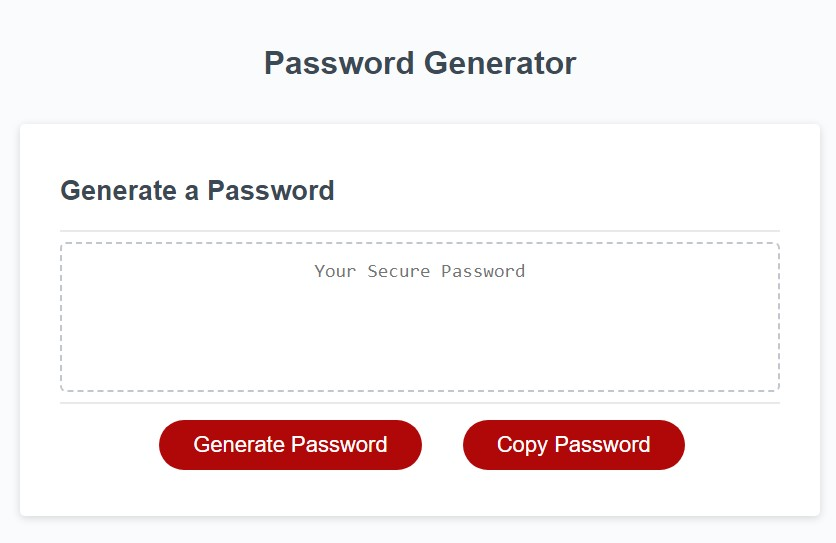

# week-3-password-generator-challenge

## Purpose of Task

Creation of a password generator by modifying starter code. The password will be randomly generated based on user-selected critera, these being length and character types.
The page will make use of JavaScript to prompt the user and update the textbox with the generated password.

## User Story

```
AS AN employee with access to sensitive data
I WANT to randomly generate a password that meets certain criteria
SO THAT I can create a strong password that provides greater security
```

## Acceptance Criteria

```
GIVEN I need a new, secure password
WHEN I click the button to generate a password
THEN I am presented with a series of prompts for password criteria
WHEN prompted for password criteria
THEN I select which criteria to include in the password
WHEN prompted for the length of the password
THEN I choose a length of at least 8 characters and no more than 128 characters
WHEN asked for character types to include in the password
THEN I confirm whether or not to include lowercase, uppercase, numeric, and/or special characters
WHEN I answer each prompt
THEN my input should be validated and at least one character type should be selected
WHEN all prompts are answered
THEN a password is generated that matches the selected criteria
WHEN the password is generated
THEN the password is either displayed in an alert or written to the page
```

## Problems Solved
- When the **Generate Password** button is clicked the user will be prompted to specify a length
    - If the user enters anything other than a number between 8 and 128, they receive an error message and must click the Generate Password button again
- The user is prompted to confirm which character types to use (lowercase, uppercase, numeric and special characters)
    - If no character types are selected, the user receives an error message and must click the Generate Password button again
- A password is then generated based on these criteria and displayed in the text box
- Once the password has been generated the user can click on the **Copy Password** button to copy their generated password to the clipboard

## Screenshot

 

## Deployed Webpage

The published page is available here: https://olivercray.github.io/week-3-password-generator-challenge/